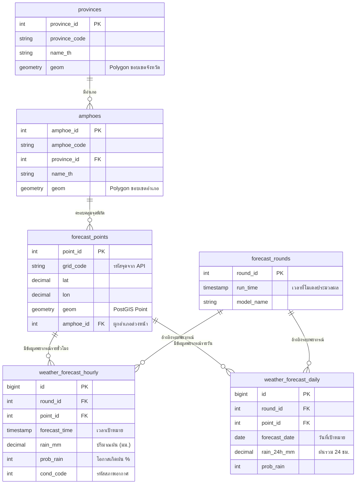

# การออกแบบฐานข้อมูลเก็บข้อมูลพยากรณ์ฝน ภาคตะวันออก (TMD NWP API)

เอกสารนี้อธิบายโครงสร้างและการออกแบบฐานข้อมูลสำหรับรองรับข้อมูลจาก **TMD Weather Forecast API (nwpapi)** โดยครอบคลุมทั้งข้อมูลพยากรณ์รายชั่วโมง (Hourly) และรายวัน (Daily) ในพื้นที่ภาคตะวันออก 8 จังหวัด ได้แก่ ชลบุรี, ระยอง, จันทบุรี, ตราด, ฉะเชิงเทรา, ปราจีนบุรี, สระแก้ว, และนครนายก

---

## 🏗️ สถาปัตยกรรมและเทคโนโลยีที่แนะนำ

1. **ระบบจัดการฐานข้อมูล (DBMS): PostgreSQL 14+ พร้อม PostGIS Extension**
   - **PostGIS** เป็นมาตรฐานที่ดีที่สุดสำหรับการเก็บข้อมูลพิกัดภูมิศาสตร์ (`Geometry/Geography`) รองรับการทำ Index เชิงพื้นที่ (Spatial Index) และฟังก์ชันคำนวณทางภูมิศาสตร์ เช่น การหาว่าจุดพิกัดอยู่ภายในขอบเขตอำเภอใด (`ST_Contains`), การแปลงเป็น GeoJSON สำหรับแสดงบนแผนที่ (`ST_AsGeoJSON`)
2. **TimescaleDB Extension (ทางเลือกเสริมสำหรับ Scale ข้อมูลใหญ่)**
   - หากมีการเก็บข้อมูลย้อนหลังสะสมหลายล้านรายการ สามารถใช้ TimescaleDB แปลงตาราง `weather_forecast_hourly` เป็น Hypertable เพื่อเพิ่มความเร็วในการ Query ตามช่วงเวลาได้หลายเท่าตัว

---

## 💡 แนวคิดการออกแบบที่สำคัญ (Key Design Principles)

### 1. Pre-computed Spatial Join (ผูกอำเภอตั้งแต่ตอนบันทึกจุด)
แทนที่จะต้องนำจุดพิกัด (`lat`, `lon`) ไปทำการคำนวณทางคณิตศาสตร์เรขาคณิต (Point-in-Polygon) เทียบกับขอบเขตอำเภอทุกครั้งที่มีการดึงรายงานปริมาณน้ำฝน เราจะสร้าง **Trigger** ให้ระบบหา `amphoe_id` และบันทึกเก็บไว้ในตาราง `forecast_points` ตั้งแต่ตอนเพิ่มจุดพิกัด 
- **ผลลัพธ์:** การหาปริมาณน้ำฝนเฉลี่ยรายอำเภอจะใช้เพียง `GROUP BY amphoe_id` ซึ่งทำงานได้เร็วในระดับ **มิลลิวินาที (Milliseconds)**

### 2. แยกรอบการพยากรณ์ (Model Round Versioning)
ข้อมูล NWP ของกรมอุตุนิยมวิทยาจะประมวลผลเป็นรอบๆ (เช่น 00 UTC, 06 UTC, 12 UTC) การสร้างตาราง `forecast_rounds` จะช่วยให้:
- ดึงข้อมูลพยากรณ์ของ "รอบล่าสุด" มาแสดงผลได้อย่างแม่นยำ
- สามารถเปรียบเทียบความแม่นยำของโมเดลย้อนหลังได้

### 3. แยกตารางรายวันและรายชั่วโมง (Table Separation)
ข้อมูลรายชั่วโมงมีปริมาณเร็วกว่ารายวัน 24 เท่า การแยกตาราง `weather_forecast_hourly` และ `weather_forecast_daily` จะทำให้ Index ของข้อมูลรายวันมีขนาดเล็ก Query หน้าต่างรายวันได้ทันทีโดยไม่ต้องไป Sum ข้อมูลรายชั่วโมง

---

## 📊 แผนภาพความสัมพันธ์ฐานข้อมูล (ER Diagram)



---

## 💻 ตัวอย่างคำสั่ง SQL สำหรับนำไปใช้งานจริง (Practical Queries)

### 1. หาปริมาณน้ำฝนเฉลี่ยรายอำเภอของภาคตะวันออก (สำหรับทำแผนที่ Choropleth Map)
คำสั่งนี้ดึงข้อมูลของรอบพยากรณ์ล่าสุด เพื่อหาปริมาณน้ำฝนเฉลี่ยของแต่ละอำเภอในวันที่กำหนด:

```sql
WITH latest_round AS (
    SELECT round_id FROM forecast_rounds ORDER BY run_time DESC LIMIT 1
)
SELECT 
    p.name_th AS province_name,
    a.amphoe_id,
    a.name_th AS amphoe_name,
    COUNT(fp.point_id) AS total_points,
    ROUND(AVG(wfd.rain_24h_mm), 2) AS avg_rain_mm,
    MAX(wfd.rain_24h_mm) AS max_rain_mm,
    ST_AsGeoJSON(a.geom) AS amphoe_geojson -- ดึงขอบเขตไปวาดสีบนแผนที่
FROM amphoes a
JOIN provinces p ON a.province_id = p.province_id
LEFT JOIN forecast_points fp ON a.amphoe_id = fp.amphoe_id AND fp.is_active = true
LEFT JOIN weather_forecast_daily wfd ON fp.point_id = wfd.point_id 
    AND wfd.round_id = (SELECT round_id FROM latest_round)
    AND wfd.forecast_date = CURRENT_DATE -- หรือวันที่ต้องการพยากรณ์
WHERE p.province_code IN ('20','21','22','23','24','25','26','27') -- รหัสจังหวัดภาคตะวันออก
GROUP BY p.name_th, a.amphoe_id, a.name_th, a.geom
ORDER BY avg_rain_mm DESC;
```

### 2. ดึงข้อมูลพิกัดจุดทั้งหมดพร้อมปริมาณฝนรายชั่วโมงในรูปแบบ GeoJSON (สำหรับวาด Marker บนแผนที่ Leaflet/Mapbox)

```sql
WITH latest_round AS (
    SELECT round_id FROM forecast_rounds ORDER BY run_time DESC LIMIT 1
)
SELECT jsonb_build_object(
    'type', 'FeatureCollection',
    'features', jsonb_agg(feature)
) AS geojson
FROM (
    SELECT jsonb_build_object(
        'type', 'Feature',
        'geometry', ST_AsGeoJSON(fp.geom)::jsonb,
        'properties', jsonb_build_object(
            'point_id', fp.point_id,
            'grid_code', fp.grid_code,
            'amphoe_name', a.name_th,
            'forecast_time', wfh.forecast_time,
            'rain_mm', wfh.rain_mm,
            'prob_rain', wfh.prob_rain
        )
    ) AS feature
    FROM forecast_points fp
    JOIN amphoes a ON fp.amphoe_id = a.amphoe_id
    JOIN weather_forecast_hourly wfh ON fp.point_id = wfh.point_id
    WHERE wfh.round_id = (SELECT round_id FROM latest_round)
      AND wfh.forecast_time = date_trunc('hour', CURRENT_TIMESTAMP + interval '1 hour')
) AS subquery;
```

---

## 📁 ไฟล์ที่เกี่ยวข้องในโปรเจกต์
- [tmd_rain_forecast_schema.sql](file:///z:/My%20Drive/98%20Antigravity/Rain_Forcast/tmd_rain_forecast_schema.sql): โค้ด SQL DDL ตัวเต็มสำหรับสร้างตาราง Index และ Trigger ทั้งระบบ
